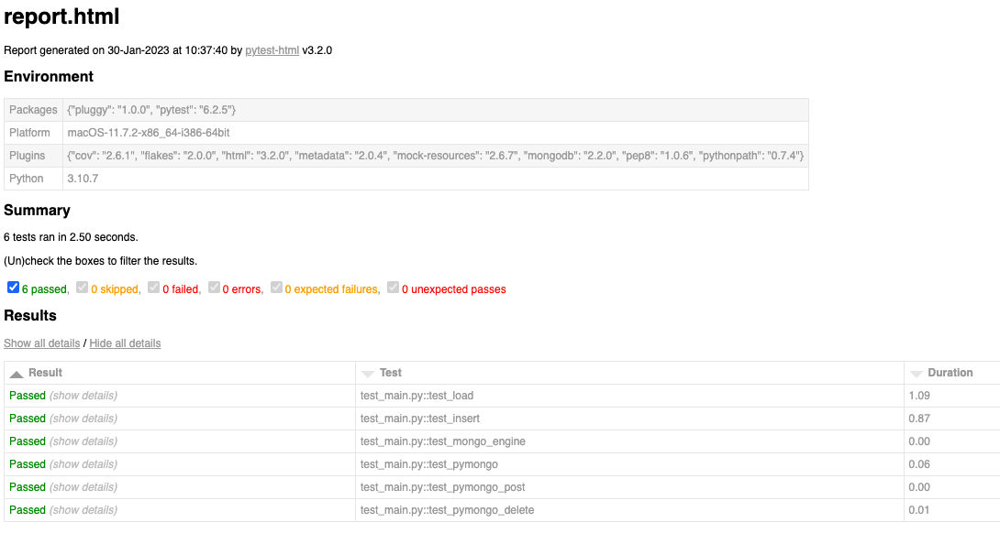
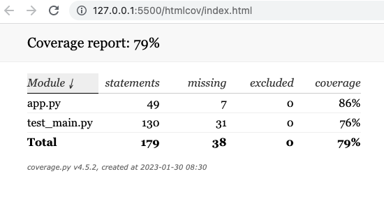

# parts-inventory

## Description

This is a Test Driven Development project of a RESTful API that mocks a parts inventory. It is a complete CRUD application that employs [Flask-PyMongo](https://flask-pymongo.readthedocs.io/en/latest/) to test the routes on a localhost server and [pytest-mongodb](https://pypi.org/project/pytest-mongodb/) to test the MongoDB connection and functionality. I commented out the actual app routes/code because I wanted to focus on testing.

The test results yielded 6 pytest tests that are PASSED and are displayed using python-html and a coverage report, shown below. The coverage for app.py is 86% because I did not test my PUT route or error handling in my DELETE/PUT routes.

